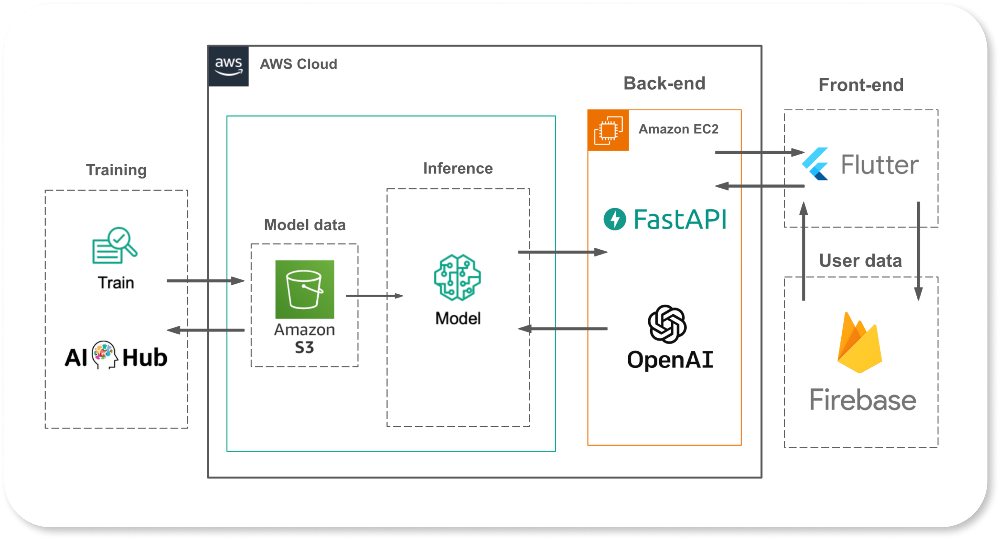

# Loro

아나운서 준비생을 위한 맞춤형 AI 스피치 연습 애플리케이션, Loro(로로)입니다.

현재 대한민국에 존재하는 대부분의 아나운서 학원은 높은 등록비와 수업료를 요구합니다. 이로 인해 경제적으로 부담이 있는 학생들은 학원 수강을 포기하거나, 부모님의 경제력에 따라 선택을 할 수밖에 없는 경우도 있습니다.

또한 대부분의 아나운서 학원은 대도시나 번화가에 위치해 있는 것으로 확인할 수 있었습니다. 지방이나 외곽 지역 거주자들에게 학원까지 이동하는데 추가적인 교통비와 시간이 소요되기에 접근성이 떨어집니다.

따라서 저희는 앱을 통해 비용적, 지리적 부담 없이 언제, 어디서나 아나운서의 발성을 연습하고 피드백 받을 수 있도록 하고자 합니다.

이때 사용자마다 사용자의 음성을 기반으로 한 아나운서 억양 개인화 TTS 모델을 만들어 이를 바탕으로 실제 학원에서 배우는 것과 유사하게 발성을 연습하고 피드백 받을 수 있습니다.

---

## General Intro

- 프로젝트 지속기간 : 2024.02 ~ 2024.05
- 시연 영상 링크 :  [https://www.youtube.com/watch?v=e1HEo-PZgQ8&feature=youtu.be](https://www.youtube.com/watch?v=e1HEo-PZgQ8&feature=youtu.be)

---

## Poster

---

## Architecture

---

## Technologies

Project is created with:

|                             | NAME                                                                                                   |
| --------------------------- | ------------------------------------------------------------------------------------------------------ |
| Language                    | `Dart` `Python`                                                                                        |
| Framework                   | `Flutter` `Firebase` `OpenAI API` `Amazon EC2` `Amazon SageMaker` `AWS S3` `FastAPI` `Figma` `Pytorch` |
| IDE                         | `VScode` `Android Studio` `Flutter Lints`                                                              |
| Source Code Management      | `Git` `Github`                                                                                         |
| Test                        | `Flutter Test `                                                                                        |
| CI/CD Pipeline              | `Github Actions` `Fastlane`                                                                            |
| Project Document Management | `Jira` `Confluence` `Wakatime`                                                                         |
| Collaboration Tools         | `Discord`                                                                                              |

---

## Developers

|  |  |  |  |
| ------------------------------------------------------------------------------------------------ | --------------------------------------------------------------------------------------------- | ---------------------------------------------------------------------------------------------- | ----------------------------------------------------------------------------------------------- |
| 안지원                                                                                           | 신민경                                                                                        | 윤하은                                                                                         | 김필모                                                                                          |
| Leader, Backend                                                                                  | Frontend                                                                                      | AI                                                                                             | AI                                                                                              |

---

## Resources

- [중간 보고서](./resources/cd_midterm-report.docx)
- [중간 발표](./resources/cd_midterm_ppt.pdf)
- [최종 발표](./resources/capstone-08-final-pt.pdf)
- [수행결과보고서](./resources/capstone-08-final-report.pdf)
- [포스터](./resources/capstone-08-final-poster.svg)
